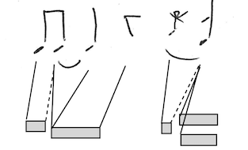

# Performance-Score representations and distances
proposition of word-distances for measuring performance-score distance.

- following principles of [DTW](DTW.md)

- with generalisation definable in a framework à la Mohri, based on weighted word transducers 


---
## performance
sequence of timestamped events ~ piano roll

**event** (infinite alphabet) made of:
- time in RTU (real or int = nb samples ?)
- pitch
- ON | OFF
- velocity

---
## score : monophonic
structured word
nested word = sequence of quantified events + markups

**events** 
(infinite alphabet of internal symbols) made of 

- tag (in finite (large) set), on of:
  - continuation (0) : tie or dot
  - note, grace note (pitch) or chord (pitch+)
  - rest
  - ...

**markups** for linearization of rhythm trees 
(finite alphabet of call and return symbols) :

- parentheses for time divisions : tuplets, bars...
  labels (tuple number, beaming policy...)

The date or duration of events, in MTU (rational),  is computed with the markups and tags (e.g. grace note has duration 0).

There are simultaneous events, since grace notes has duration 0. They are ordered.

Finite bound on the number of duration ratio. ?


see [rhythm-nested-words](rhythm-nested-words) for concrete examples of structured words.


---
## score : polyphonic
several voices for one part (polyphonic instrument)

**merge of structured words**
- one sequence per voice, merged inside bars
- ordered chronologically
- every internal event is tagged with a voice number

question: 
- define the position of the markups.
- markup tagged by voice numbers?

**integration of several voices into one structured word**
- use the gcd of tuples
- every internal event is tagged with a voice number
- markup not tagged by voice numbers
- a posteriori projections and term-rewriting of tuples
  (the merged score is not the final score)


---
## performance-score distance (mono)

alignement (like [DTW](DTW.md)) between 
the performance events and
the internal score events.
the score markups are not aligned to performance. their purpose is to compute the MTU date of internal score events.

**ex.** one 4/4 bar



score internal events (there is a 4-uple markup on top of them):
1. eight note1 (pitch p1)
2. eight note2 (pitch p2)
3. quarter note3 tied to previous (pitch p2)
4. quarter rest 
5. grace-note (pitch p3)
6. chord (quarter) (pitches p4-p5)

performance events:
- ON1  (pitch p1)
- OFF1 (pitch p1)
- ON2  (pitch p2)
- OFF2 (pitch p2)
- ON3  (pitch p3)
- OFF3 (pitch p3)
- ON4  (pitch p4)
- ON5  (pitch p5)
- OFF5 (pitch p5)
- OFF4 (pitch p4)

DTW alignments:
- ON1 - note1
- OFF1 - note2  // grace rest, will be ignored
- ON2 - note2
- ON2 - note3   // tied notes
- OFF2 - rest   // rest, not ignored
- ON3 - grace-note
- OFF3 - chord  // grace rest, ignored
  [opt] OFF3 - grace-note
- ON4 - chord
- ON5 - chord
- OFF4 - next or nothing if end of score
- OFF5 - next or nothing if end of score

cases: 
- grace-rest = offset aligned with note that has other alignments
  it is not written in score!
- chord = several onsets aligned to the same 'chord' score events
- tie or dot : one onset aligned to several successive events (note or chord)
  dotted rest = one single event. there are no tied rests.
  dotted note = 2 events
  

---

## computation of distance

while reading left-to-right a score word representation, one can maintain a current MTU duration

- initially it is 1 (1 bar)
- when reading a open-markup of $`t`$-uplet, we divide by $`t`$
- when reading a open-markup of $`t`$-uplet, we multiply by $`t`$
- the MTU duration of an internal symbol read is the current duration
  except grace-notes/chords which have duration 0.

**ex.** The word representation of the above 4/4 measure is :

```
[4 [2 N N 2] _ R G C 4]
```

the two first N have duration 1/8

the next elements have duration 1/4, except the G (duration 0).


- if the depth (of markups) is bounded, the number of possible durations is finite.
- for a pushdown automaton, the duration may be pushed onto the stack 
  the stack alphabet is infinite for Symbolic Visibly Pushdown Automata


## tempo

Following the definition of [edit-distances](distance-languages.md) and [DTW](DTW.md), we need the same alphabet for performances and scores. This requires converting the MTU timestamps in scores into RTU timestamps like in performance symbols. The relationship between the MTU durations and RTU durations (performance word) is defined by a tempo curve.

For a constant fixed tempo, we can built a Weighted Symbolic Visibly Pushdown Transducer computing the performance-score distance.

Using a tempo model like the one of [Large](tempo-Large.md), we can maintain and update a current tempo value (i.e. build a stepwise-constant tempo curve on-the-fly, left-to-right) enabling the MTU-RTU conversion.


