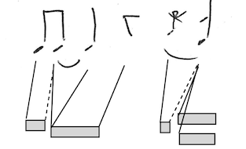

# Performance-score distances
proposition of word-distances for measuring performance-score distance.

- following principles of [DTW](DTW.md)

- with generalisation definable in a framework à la Mohri, based on weighted word transducers 

---
## performance
sequence of timestamped events ~ piano roll

**event** (infinite alphabet) made of:
- time in RTU (real or int = nb samples ?)
- pitch
- ON | OFF
- velocity

---
## score : monophonic
structured word
nested word = sequence of quantified events + markups

**events** 
(infinite alphabet of internal symbols) made of 
- duration in MTU (ratio)
  can be 0 for grace note (simult. event ordered)
  finite bound on the number of ratio ?
- tag (in finite (large) set), on of:
  - continuation (0) : tie or dot
  - pitch (note, grace note) or pitch+ (chord)
  - rest

**markups** for linearization of rhythm trees 
(finite alphabet of call and return symbols) :
- parentheses for time divisions : tuples, bars...
  labels (tuple number, beaming policy...)

---
## score : polyphonic
several voices for one part (polyphonic instrument)

**merge of structured words**
- one sequence per voice, merged inside bars
- ordered chronologically
- every internal event is tagged with a voice number

question: 
- define the position of the markups.
- markup tagged by voice numbers?

**integration of several voices into one structured word**
- use the gcd of tuples
- every internal event is tagged with a voice number
- markup not tagged by voice numbers
- a posteriori projections and term-rewriting of tuples
  (the merged score is not the final score)

---
## distance score-performance (mono)

alignement (like [DTW](DTW.md)) between 
the performance events and
the internal score events.
the score markups are not aligned to performance.

ex: one 4/4 bar

score internal events (there is a 4-uple markup on top of them):
1. eight note1 (pitch p1)
2. eight note2 (pitch p2)
3. quarter note3 tied to previous (pitch p2)
4. quarter rest 
5. grace-note (pitch p3)
6. chord (quarter) (pitches p4-p5)

performance events:
- ON1  (pitch p1)
- OFF1 (pitch p1)
- ON2  (pitch p2)
- OFF2 (pitch p2)
- ON3  (pitch p3)
- OFF3 (pitch p3)
- ON4  (pitch p4)
- ON5  (pitch p5)
- OFF5 (pitch p5)
- OFF4 (pitch p4)

DTW alignments:
- ON1 - note1
- OFF1 - note2  // grace rest, will be ignored
- ON2 - note2
- ON2 - note3   // tied notes
- OFF2 - rest   // rest, not ignored
- ON3 - grace-note
- OFF3 - chord  // grace rest, ignored
  [opt] OFF3 - grace-note
- ON4 - chord
- ON5 - chord
- OFF4 - next or nothing if end of score
- OFF5 - next or nothing if end of score

cases: 
- grace-rest = offset aligned with note that has other alignments
  it is not written in score!
- chord = several onsets aligned to the same 'chord' score events
- tie or dot : one onset aligned to several successive events (note or chord)
  dotted rest = one single event. there are no tied rests.
  dotted note = 2 events
  